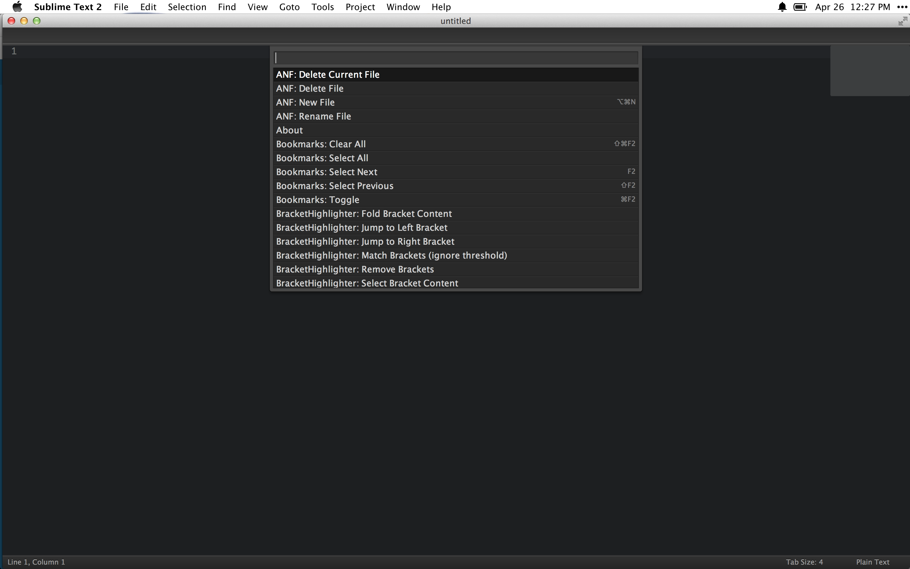
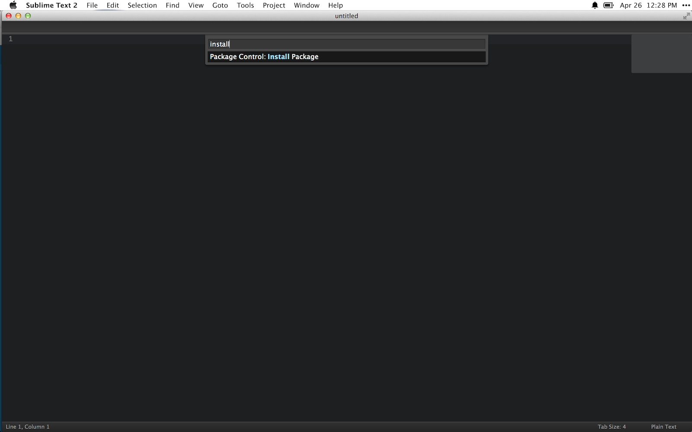
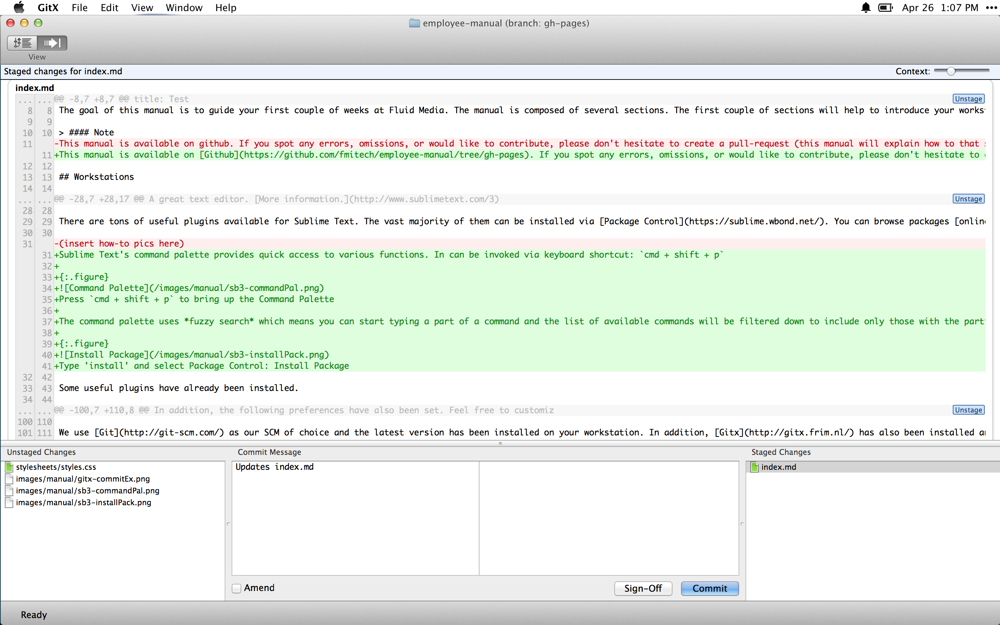
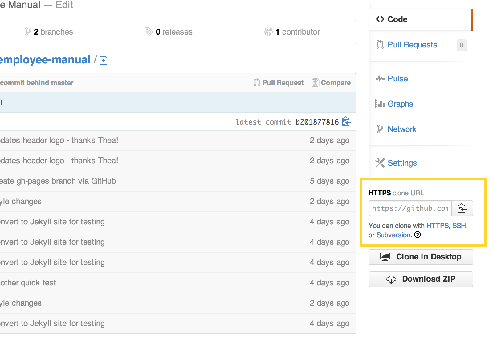
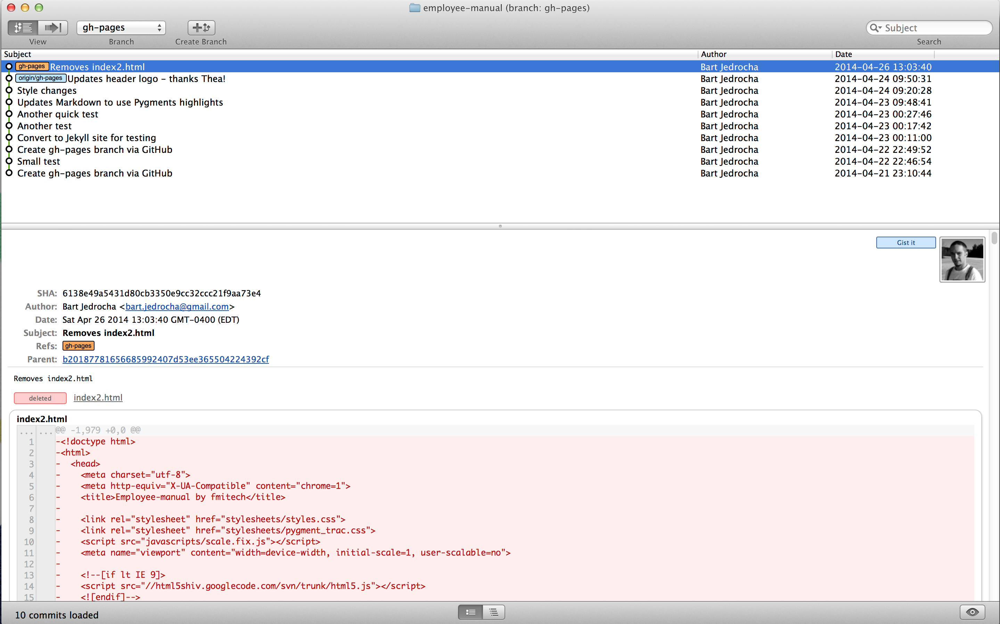
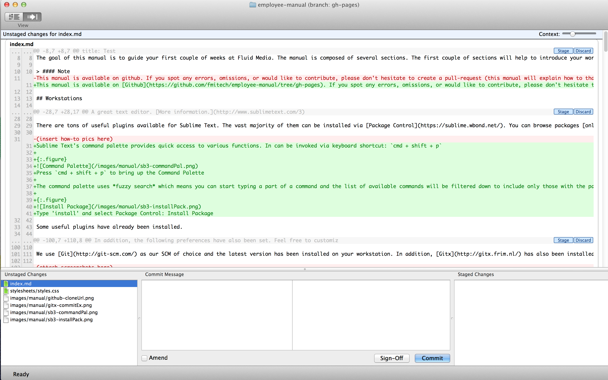
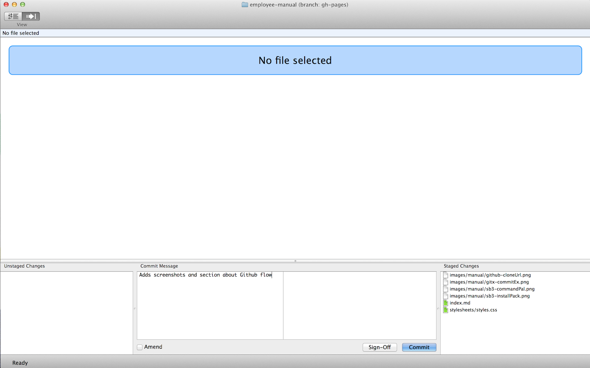

## Welcome to Fluid Media

The goal of this manual is to guide your first couple of weeks at Fluid Media. The manual is composed of several sections. The first couple of sections will help to introduce your workstations and the various tools you'll use in your everyday development, most notably source control.

> #### Note
This manual is available on [Github](https://github.com/fmitech/employee-manual/tree/gh-pages). If you spot any errors, omissions, or would like to contribute, please don't hesitate to create a pull-request (this manual will explain how to that shortly :)

## Workstations

> "This is my workstation, there are many like it but this one is mine."

Your workstations have been setup to be development ready. We use a provisioning tool called *KitchenPlan* to automate setup and configuration of development machines. The company's KitchenPlan repo is maintained [here](https://github.com/fmitech/kitchenplan/tree/version2). Take a look if you're curious how the machine was setup.

You can add/modify features/applications based on your prefrence.

### Installed applications/components

Along with the base operating system, the following additional software has also been installed.

#### Sublime Text 3

A great text editor. [More information.](http://www.sublimetext.com/3)

There are tons of useful plugins available for Sublime Text. The vast majority of them can be installed via [Package Control](https://sublime.wbond.net/). You can browse packages [online](https://sublime.wbond.net/browse) and then use the Command Palette to install.

Sublime Text's command palette provides quick access to various functions. In can be invoked via keyboard shortcut: `cmd + shift + p`

{:.figure}

Press `cmd + shift + p` to bring up the Command Palette

The command palette uses *fuzzy search* which means you can start typing a part of a command and the list of available commands will be filtered down to include only those with the partially typed word. E.g. you can start typing 'syntax' to bring up all the commands related to syntax highlighting. Type 'install' to use the Package Control Install command.

{:.figure}

Type 'install' and select Package Control: Install Package

Some useful plugins have already been installed.

| Package | Description |
| ------- | ----------- |
| [AdvancedNewFile](https://sublime.wbond.net/packages/AdvancedNewFile) | Allows for faster file creation within a project |
| [Alignment](https://sublime.wbond.net/packages/Alignment) | Key-binding for aligning multi-line and multiple selections |
| [Bracket​Highlighter](https://sublime.wbond.net/packages/BracketHighlighter) | Matcher for a variety of brackets |
| [Emmet](https://sublime.wbond.net/packages/Emmet) | Zen-Coding |
| [Git](https://sublime.wbond.net/packages/Git) | Git integration |
| [GitGutter](https://sublime.wbond.net/packages/GitGutter) | Show git line status in gutter |
| [SideBarEnhancements](https://sublime.wbond.net/packages/SideBarEnhancements) | Enhances the Sidebar |
| [Sass](https://sublime.wbond.net/packages/Sass) | Syntax highlighting and tab/code completion for Sass and SCSS files |
| [SCSS](https://sublime.wbond.net/packages/SCSS) | Additional syntax for SCSS files |
| [ApplySyntax](https://sublime.wbond.net/packages/ApplySyntax) | Syntax detector for a wide variety of files |
| [Pretty JSON](https://sublime.wbond.net/packages/Pretty%20JSON) | Prettifies JSON documents |
| [Theme - Soda](https://sublime.wbond.net/packages/Theme%20-%20Soda) | A UI Theme |
| [Theme - Flatland](https://sublime.wbond.net/packages/Theme%20-%20Flatland) | A UI Theme |
| [Theme - Spacegray](https://sublime.wbond.net/packages/Theme%20-%20Spacegray) | A UI Theme |
| [Tomorrow Color Schemes](https://sublime.wbond.net/packages/Tomorrow%20Color%20Schemes) | Additional Color Schemes |

In addition, the following preferences have also been set. Feel free to customize these to your liking. To modify, _Preferences > Settings - User_.


{
    "auto_complete": true,
    "auto_complete_commit_on_tab": true,
    "auto_complete_with_fields": true,
    "bold_folder_labels": true,
    "color_scheme": "Packages/Tomorrow Color Schemes/Tomorrow-Night.tmTheme",
    "ensure_newline_at_eof_on_save": true,
    "fade_fold_buttons": false,
    "file_exclude_patterns":
    [
        ".DS_Store",
        ".gitkeep",
        "dump.rdb"
    ],
    "folder_exclude_patterns":
    [
        ".svn",
        ".git",
        ".hg",
        "CVS",
        "tmp",
        ".bundle",
        ".sass-cache",
        "log",
        "cache"
    ],
    "font_face": "Monaco",
    "font_size": 14,
    "highlight_line": true,
    "highlight_modified_tabs": true,
    "ignored_packages":
    [
        "Vintage"
    ],
    "scroll_past_end": true,
    "soda_folder_icons": true,
    "tab_size": 4,
    "theme": "Soda Dark 3.sublime-theme",
    "translate_tabs_to_spaces": true,
    "trim_trailing_white_space_on_save": true
}


#### Git, Gitx

We use [Git](http://git-scm.com/) as our SCM of choice and the latest version has been installed on your workstation. In addition, [Gitx](http://gitx.frim.nl/) has also been installed and provides a nice GUI for reviewing your changes prior to committing and viewing version history.

{:.figure}

#### Homebrew, Homebrew Cask

[Homebrew](http://brew.sh/) is a package manager for OS X (similar to apt-get on Ubuntu or yum on Fedora). You can use it to install packages of various software (e.g. _mysql_, _imagemagick_, _wget_, etc.). [Homebrew Cask](http://caskroom.io/) extends Homebrew and provides a CLI for installing OS X binaries.

To use:


$ brew install redis
$ brew cask install google-drive


#### RVM

[RVM](http://rvm.io/)(Ruby Version Manager) is a tool that allows you to manage and work with multiple ruby versions and environments.

Listing installed rubies:


$ rvm list


Installing a version of ruby


$ rvm install ruby-2.1.0


Using a version of ruby


$ rvm use ruby-2.1.0


It is recommended that you read the [RVM Documentation](http://rvm.io/), in particular the sections about [upgrading](http://rvm.io/rvm/upgrading), [installing rubies](http://rvm.io/rubies/installing), [setting a default ruby](http://rvm.io/rubies/default), [gemsets](http://rvm.io/gemsets), and [best practices](http://rvm.io/rvm/best-practices).

#### Other

| Type | Installed | Notes |
| ---- | --------- | ----- |
| Browsers | Google Chrome, Firefox, Safari | |
| Databases | MySQL, Postgres, SQLite, Redis | MySQL password: `password` |
| Virtualization | VMWare Fusion, VirtualBox, Vagrant | |

## Accounts

There are several accounts you'll need to have setup and configured in your first couple of days. Some of these accounts, like email, will be provided for you; other's you'll need to setup yourself. This section provides an overview and brief explanation of the accounts you'll need.

### Email (provided)

Self-explanitory. Once you have your email address and password, you can login to see your email at [http://mail.fluidmedia.ca](http://mail.fluidmedia.ca). We use Google Apps for Business so if you use Gmail as your personal email service, this should feel right at home.

### Basecamp (provided)

[Basecamp](https://basecamp.com/) is a project management tool and probably the most popular Ruby on Rails application running in production. We use Basecamp to manage projects, to correspond with clients, and to correspond with other team members. Once you have your login and password, you can login at [https://launchpad.37signals.com/basecamp](https://launchpad.37signals.com/basecamp).

### Messages.app (provided)

Throughout the day, we use the Messages app to communicate with other team members in and out of the office. The Messages app is already installed on your machine but you'll need to setup your account with the credentials provided.

Open the Messages application, then select _Preferences_ (you can use `cmd + ,` as a shortcut). In the _Preferences_ dialog, click on _Accounts_ then click the _+_ icon to add your account. Select _Other messages account..._ and hit _Continue_. For _Account Type_ select _Jabber_, for _Account Name_ and _Password_ enter the login information you've been provided. Set the _Server_ to `optimus2.fluidmedia.com`, the _Port_ to `5223` and make sure _Use SSL_ is selected. Finally, click on _Create_.

This will log you onto the chat server and you should see everyone in the organization.

#### Chat Rooms

Along with communicating with other team members directly, we also have chatroom setup for general discussions. To join, hit `cmd + r` on your keyboard. In the dialog, enter `devchat` for _Room Name_ and hit _Go_.

### Github

Github is a hosted Git (discussed later) service provider and where we keep the majority of our code. You'll need a Github account if you don't already have one. When signing up, we recommend that you use your personal email. This way you can keep your account if you ever leave Fluid Media. Go to [https://github.com](https://github.com) to sign up or sign in. Once your account is created, we'll add you to the necessary organizations and repos.

### Bitbucket

Bitbucket is another hosted source control service provider that offers both Git and Hg support (both of these will be discussed later). The bulk of our .NET projects is hosted on Bitbucket. The signup for Bitbucket is a little easier as it allows you to login via your Google or Github account. You can also create an account if you prefer by visiting [https://bitbucket.org](https://bitbucket.org). Once your account is created, we'll add you to the necessary organizations and repos.

### Beanstalk (provided)

Beanstalk is yet another hosted source control service provider although it only houses our older projects. Access is by invitation only so you'll receive an email with instructions on how to setup your account.

### Trello

Trello is an organization tool that provides virtual [Kanban](http://en.wikipedia.org/wiki/Kanban_board) boards. We use Trello to manage tasks for a particular project/sprint. The easiest way to get started with Trello is to signup via your Google (personal) account at [https://trello.com/signup](https://trello.com/signup). Once your account is created, we'll add you to the necessary organizations.

*   *   *

# Git

This section will outline the fundamentals of using Git, including 1) configuration 2) basic usage 3) project workflow.

## Configuration

Before you can begin using Git, you'll need to configure some basic properties, mainly your username and your email. These will be used to identify your commits. In addition, you'll also configure an authentication mechanism.

To configure these settings, you'll need to open up your terminal.

### Username

First you need to tell git your name, so that it can properly label the commits you make.


$ git config --global user.name "Your Name Here"
# Sets the default name for git to use when you commit


### Email

Git saves your email address into the commits you make. Sites like Github use this information to associate your commits with your Github account. Your email address should be the same one associated with your Github/Bitbucket account.


$ git config --global user.email "your_email@example.com"
# Sets the default email for git to use when you commit


### HTTPS Authentication

Git supports both HTTPS and SSH. Which you use is up to you although Github/Bitbucket recommend HTTPS. This section describes working with HTTPS repos, please see the [SSH Authentication](#ssh-authentication) section on working with SSH repos.

When you clone a HTTPS repo, you'll be asked to provide your username and password. If you don't want to keep typing your username and password every time you talk with the remote server, you'll need to configure your _credential.helper_.

This should already be configured on your system as Git was installed via Homebrew. As a sanity check, verify that your credential.helper is properly set


$ git config --global credential.helper
osxkeychain


> On Linux this is slightly different. The credential.helper will store your credentials in memory for a certain time (default is 15 minutes). You can change this timeout if you like

$ git config --global credential.helper 'cache --timeout=3600'
# Set the cache to timeout after 1 hour (setting is in seconds)


### SSH Authentication

When you clone a repo using SSH, your SSH keys are used for authentication. The following describes how to generate an SSH key pair and add it to Github and Bitbucket.

#### Generating SSH Keys

To generate a new SSH key, copy and paste the text below, making sure to substitute in your email. The default settings are preferred, so when you're asked to "enter a file in which to save the key,"" just press enter to continue.


$ ssh-keygen -t rsa -C "your_email@example.com"
# Creates a new ssh key, using the provided email as a label
# Generating public/private rsa key pair.
# Enter file in which to save the key (/Users/you/.ssh/id_rsa): [Press enter]


Next, you'll be asked to enter a passphrase. Please don't leave these blank, enter an actual passphrase.


Enter passphrase (empty for no passphrase): [Type a passphrase]
# Enter same passphrase again: [Type passphrase again]


Which should give you something like this:


Your identification has been saved in /Users/you/.ssh/id_rsa.
# Your public key has been saved in /Users/you/.ssh/id_rsa.pub.
# The key fingerprint is:
# 01:0f:f4:3b:ca:85:d6:17:a1:7d:f0:68:9d:f0:a2:db your_email@example.com


To prevent entering your passphrase over and over again, add your new key to the ssh-agent.


$ ssh-add id_rsa


#### Adding your SSH key to Github and Bitbucket

The [following guide](https://help.github.com/articles/generating-ssh-keys#step-3-add-your-ssh-key-to-github) provides clear instructions how to add your SSH key to Github. Similarly, [this guide](https://confluence.atlassian.com/pages/viewpage.action?pageId=270827678#SetupSSHforGitandMercurialonMacOSX/Linux-Step6.InstallthepublickeyonyourBitbucketaccount) has instructions on adding your SSH key to Bitbucket.

That's all there is to it. You are now ready to clone both HTTPS and SSH repos on both Github and Bitbucket.

## Basic Usage

This section describes the basics of using Git. You'll learn how to initialize an empty Git reposity, track files, create and undo commits, branch and merge, work with remotes, and git specific concepts like rebasing. Let's get started.

### Initializing a Git repository

Start by creating a new folder anywhere on you filesystem. In these examples we're using the Destkop.


$ cd ~/Desktop
$ mkdir my-awesome-project && cd my-awesome-project


Within the newly created folder, create a `README.txt` file (after all, all awesome projects contain a README). Using an editor, add some content to the README file.


$ touch README.txt
$ echo "This is my awesome project." >> README.txt


Great, our project is underway and while we don't have much, it's never to early to start tracking your changes with Git. Start by initializing a Git repository within our project folder.


$ git init
Initialized empty Git repository in /Users/tdurden/Desktop/my-awesome-project/.git/


With Git initialized, we can now use the `git` command within this directory to perform various operations. Let's start by checking the status.


$ git status
# On branch master
#
# Initial commit
#
# Untracked files:
#   (use "git add <file>..." to include in what will be committed)
#
#   README.txt
nothing added to commit but untracked files present (use "git add" to track)


The `git status` command provides information about the current state of our repository. It tells us that we're on the `master` branch (more on this later) and it tells us that we have some untracked files (the README.txt file that we created in the previous step).

### Adding files to repository

When you create new files within a Git repository, they are untracked by default. You need to tell Git to track the files you want. As you may have guessed from the output of `git status`, tracking of files is done via the `git add` command. Let's track the README.txt file we created earlier and check the output of `git status` again.


$ git add README.txt
$ git status
# On branch master
#
# Initial commit
#
# Changes to be committed:
#   (use "git rm --cached <file>..." to unstage)
#
#   new file:   README.txt
#


Git is now tracking our README.txt file. From the output of `git status`, we can see that Git recognizes our README.txt as a new file.

> If we had multiple files to add, it would be tedious to call `git add` on every file. In these situations, you can use `git add .` to add all untracked files.

### Committing state

We're satisfied with the current state of our project so let's go ahead and commit our changes. You can think of commits as _snapshots_ of your project during a point in time.


$ git commit -m "Initial Commit"
[master (root-commit) 4634299] Initial Commit
 1 file changed, 1 insertion(+)
 create mode 100644 README.txt


Great, our project state is now saved. We can once again perform a `git status` to ensure we didn't miss anything.


$ git status
# On branch master
nothing to commit, working directory clean


The output is fairly self-explanitory. We have nothing to commit (we just committed our changes) and our working directory is clean (we don't have any conflicts or untracked files).

### Modifying files

Let's make some more changes to our `README.txt` file. Awesome projects always include license info so let's add that next. Open `README.txt` in your favourite editor and change its contents as follows:


This is my awesome open source project.

Released under the MIT License.


Save the file. Let's perform a `git status` to see where we're at.


$ git status
# On branch master
# Changes not staged for commit:
#   (use "git add <file>..." to update what will be committed)
#   (use "git checkout -- <file>..." to discard changes in working directory)
#
#   modified:   README.txt


Because git is already tracking `README.txt`, the output now shows that it has been modified. Let's save the state by first staging the file and then committing.


$ git add README.txt
$ git commit -m "Updated README with license information"
[master 6d443f3] Updated README with license information
 1 file changed, 3 insertions(+), 1 deletion(-)


> The above might be confusing at first. Why are we calling `git add` again? Why is saving state a 2-step process? To answer this, we need to introduce the concept of a __staging area__. Most version control systems use 2 places to store data, your working copy (the files and folders you're currently using) and the datastore (where the version control software decides how to pack and store your changes). In Git, there is a 3rd place called the _staging area_ or _index_. Using the staging area decouples the changes made to the working copy and what gets saved in Git by allowing the developer to build up their commits however they want.
>
> To give a practical example, suppose you went on a caffeine-fueled hacking frenzy and implemented several features and fixed numerous bugs without saving state in-between. Without a staging area, you'd most likely be forced to create a giant commit that encompasses all these features and bug fixes - not ideal as it makes reverting difficult. Having a staging area allows you to 'cherry-pick' and 'stage' the changes you want (even from a single file) before packaging it up in a commit. This allows you to create small succinct commits.

### Ignoring files

Next, we'll want to create a small text file to keep track of any minor _todos_ we need to perform as we're developing a specific feature. Go ahead and create the file.


$ touch todos.txt


Let's do a `git status` to see where we're at


$ git status
# On branch master
# Untracked files:
#   (use "git add <file>..." to include in what will be committed)
#
#   todos.txt
nothing added to commit but untracked files present (use "git add" to track)


Now if you think about it, this file doesn't really belong in source control. After all, the file will be specific to the developer using it and won't benefit from being versioned. Let's ask Git to ignore this file.

Ignoring files in Git is super easy and accomplished by adding a special `.gitignore` file (the `.` at the beginning is important) to the root of the repository. The contents of this file list the files to ignore.

Let's start by creating the `.gitignore` file


$ touch .gitignore


Open this newly created file inside your favourite editor, add the following line and save the changes.


todos.txt


Let's do a `git status` to see if that worked.


$ git status
# On branch master
# Untracked files:
#   (use "git add <file>..." to include in what will be committed)
#
#   .gitignore
nothing added to commit but untracked files present (use "git add" to track)


Hey great! `todos.txt` is no longer being listed and is being ignored by Git. As for the `.gitignore` file, that should be added to source control.


$ git add .gitignore
$ git commit -m "Adds .gitignore to project"
[master 3083bd3] Adds .gitignore to project
 1 file changed, 1 insertion(+)
 create mode 100644 .gitignore

$ git status
# On branch master
nothing to commit, working directory clean


> The `.gitignore` file isn't only limited to matching files. You can ignore entire folders and specify glob patterns for ignoring certain types of files (e.g. `*.log`)
>
> When working with frameworks like Ruby on Rails or .NET, you can find sample `.gitignore` files online that list commonly ignored components.

### Undoing commits

If you would like to revert a commit, Git provides several options that vary in how they modify the working copy. Each option is useful depending on your scenario. To illustrate the options, let's create a new file called `test.txt` and add some content.


$ touch test.txt
$ echo "This is only a test" >> text.txt


Next we'll add and commit this new file like we did previously with our README


$ git add test.txt
$ git commit -m "Adds text.txt for testing"
[master 01d4b04] Adds text.txt for testing
 1 file changed, 1 insertion(+)
 create mode 100644 test.txt


#### Normal revert

If we forgot to add something to the commit or forgot to include a modification, we can use the `git reset` command to do a normal revert.


$ git reset HEAD~1
$ git status
# On branch master
# Untracked files:
#   (use "git add <file>..." to include in what will be committed)
#
#   test.txt
nothing added to commit but untracked files present (use "git add" to track)


As we can see, a normal revert will return the working copy to the state it was prior to staging and committing.

Add and commit the file again before continueing.

#### Soft revert

If we made a spelling mistake in our commit message or want to modify it slightly while leaving all committed changes in the staging area, we can use `git reset` with the `--soft` option.


$ git reset --soft HEAD~1
$ git status
# On branch master
# Changes to be committed:
#   (use "git reset HEAD <file>..." to unstage)
#
#   new file:   test.txt
#


As we can see, a soft revert will leave the reverted changes in the staging area. This is especially useful if all you're doing is modifying the commit message.

Before we continue, let's unstage and remove the `test.txt` file as we'll no longer need it.


$ git reset HEAD test.txt
$ rm test.txt


#### Hard revert

If we completely messed up a previous commit and want to return our working copy to a pristine state, we can use the `git reset` with the `--hard` option.

To illustrate this, modify the README file


This is my awesome open source project.

Released under the MIT License.

THIS CHANGE WILL ULTIMATELY BE EREASED


Commit the changes


$ git add README.txt
$ git commit -m "Modifies README"
[master bb55d36] Modifies README
 1 file changed, 3 insertions(+), 1 deletion(-)


Now, revert the changes


$ git reset --hard HEAD~1
HEAD is now at 3083bd3 Adds .gitignore to project
$ git status
# On branch master
nothing to commit, working directory clean


As you can see, using the `--hard` option will not only revert the commit, but will also discard any changes made in that commit from the working copy, essentially restoring it to the state of a previous commit.

> In the examples above, all `git reset` commands were called with `HEAD~1`. The number following the `~` (tilde) indicates the number of commits to undo.

### Branching and Merging

Git's real power lies in branching and merging. Branching allows you to diverge your code from the main line of development and continue to do work without messing with the main line. Similarly, merging allows to merge a divergent branch back into the main line of development.

> #### Why bother?
>
> Why not just modify and commit to the main line of development? While this process works fine for small projects with only one or two developers, it quickly breaks down as project complexity increases or more people are added to the project.
>
> Here's a practical example. Let's assume that we have a web application that is already running in production and is being contributed to by several developers. One of these developers has been asked to implement an experimental feature that may or may not ship in a future version of the application. The commits for this experimental feature are all in the main line of development. Now let's assume that a critical bug has been discovered in production and another developer needs to quickly add a patch to fix the bug. Since all commits for this project are on the main line (including commits from an un-tested and partially implemented experimental feature) the developers now have a major problem. It will be difficult to commit the patch and deploy the fix without also exposing un-tested code to production.
>
> This is where branching comes in. The developer working on the experimental feature could have created a separate branch to house all their commits, leaving the main line of development unaffected. When the critical bug is discovered, the other developer can quickly patch the main line of development without also introducing unwanted commits to production. Once the experimental feature is complete and tested, the feature can be merged back into the main line for inclusion in a future release.

We'll see later how we can use Git's awesome branching and merging functionality to develop an ideal workflow for most projects. For now, let's just concentrate on the basics.

We've already seen one example of a branch. Recall the output of `git status` within our project directory.


$ git status
# On branch master
nothing to commit, working directory clean


As you can see, all git repositories start with a main branch called the _master_ branch. Typically this branch will be the main line of development with branches diverging from and merging to this branch.

### Branching

Let's introduce two new git commands. The first, `git branch` will list all branches in the repository. The second `git checkout` will allow to switch between branches as well as create new branches.


$ git branch
* [1] master


Right now we only have one branch, `master`. Let's create a new branch to isolate a new feature we want to work on. To create a new branch, use the `git checkout` command with the `-b` option followed by the name of the branch you would like created


$ git checkout -b awesome-new-feature
Switched to a new branch 'awesome-new-feature'


The above creates a new branch called `awesome-new-feature` and git has automatically switched to this new branch. Let's take a look at the output of `git branch`


$ git branch
* [1] awesome-new-feature
  [2] master


As expected, we now have two branches. The asterisk (\*) indicates the currently selected branch.

Let's once again modify the `README.txt` file with some information about our new feature. Open the file within your text editor and modify it to include the following


This is my awesome open source project.

Features
========
- awesome new feature

Released under the MIT License.


As we've done previously, let's commit this changeset.


$ git add README.txt
$ git commit -m "Adds documentation about awesome new feature"
[awesome-new-feature 45c63f5] Adds documentation about awesome new feature
 1 file changed, 4 insertions(+)


The output of the commit command will show you the branch along with the commit number (in our case, we've just committed to the `awesome-new-feature` branch and our commit number is `45c63f5`)

> Unlike centralized version control systems which use revision numbers, Git uses hashes to uniquely identify commits.

Let's confirm that the changes we just made did not in fact affect the master branch. We can use the `git log` command to view recent commits.


$ git log --graph --decorate --oneline
* 45c63f5 (HEAD, awesome-new-feature) Adds documentation about awesome new feature
* 3083bd3 (master) Adds .gitignore to project
* 6d443f3 Updated README with license information
* 4634299 Initial Commit


The `git log` command shows the commit hash, branch information, and commit messages of recent commits. As we can see, our last commit was made to the `awesome-new-feature` branch. Let's switch back to the master branch and see the output of `git log`. We can switch between branches using the `git checkout` command.


$ git checkout master
Switched to branch 'master'

$ git log --graph --decorate --oneline
* 3083bd3 (HEAD, master) Adds .gitignore to project
* 6d443f3 Updated README with license information
* 4634299 Initial Commit


As you can see, the changes we made in the `awesome-new-feature` branch did not affect the master branch. If you open the `README.txt` file in your editor, you'll notice that the changes we added are not there.

### Merging

We're satisfied with our awesome new feature and we now want to merge the commits in our `awesome-new-feature` branch back into the `master` branch. This is done via the `git merge` command.


$ git merge awesome-new-feature
Updating 3083bd3..45c63f5
Fast-forward
 README.txt | 4 ++++
 1 file changed, 4 insertions(+)


Don't worry about the output of the merge command just yet, we'll explain the concepts of _fast-forward_ and _rebase_ later in this guide. For now, let's focus on the state of our working copy. Take another look at the output of the `git log` command.


$ git log --graph --decorate --oneline
* 45c63f5 (HEAD, master, awesome-new-feature) Adds documentation about awesome new feature
* 3083bd3 Adds .gitignore to project
* 6d443f3 Updated README with license information
* 4634299 Initial Commit


The output shows that our working copy (`HEAD`), the master branch, and the awesome-new-feature branch are all pointing to the same last commit, meaning our changes have been successfully merged back into our master branch. If you inspect the `README.txt` file now, you'll notice that it's been updated with the modifications we made in the `awesome-new-feature` branch.

Since we're done with the `awesome-new-feature` branch, let's go ahead and delete it. This is accomplished with the `git branch` command and the `-d` option.


$ git branch -d awesome-new-feature
Deleted branch awesome-new-feature (was 45c63f5).


### Working with Remotes

The Git repository that we've setup and have been using to date is only local to our machine. While this is one of the benefits of a distributed version control system, at some point you'll want to share your code and collaborate with other developers. To do this, we'll need to setup a remote. A remote is basically a git repo running on a git server somewhere and accessible to all developers on the project. This Git server can be self-hosted or provided via a git-hosting service like Github or Bitbucket. We'll use Github for this guide.

#### Creating the remote repo

Login to Github and create a new repository. Name the repository as `my-awesome-project`, add a short description, make the repository _Public_ and make sure that the option _Initialize this repository with a README_ is unchecked. Click the _Create repository_ button.

The repo has been created and now Github provides us with some helpful hints on how to proceed. We'll want to follow the steps outlined in the second option as we've already created a Git repository in previous steps. We'll start by first adding a remote using the `git remote add` command


$ git remote add origin git@github.com:your-username/my-awesome-project.git


Next, we'll want to synchronize our local repository with the remote repository by _pushing_ our local changes to the remote. This is accomplished with the `git push` command


$ git push -u origin master
Counting objects: 12, done.
Delta compression using up to 8 threads.
Compressing objects: 100% (8/8), done.
Writing objects: 100% (12/12), 1.15 KiB | 0 bytes/s, done.
Total 12 (delta 0), reused 0 (delta 0)
To git@github.com:bjedrocha/my-awesome-project.git
 * [new branch]      master -> master
Branch master set up to track remote branch master from origin.


If you now refresh the Github project page, you'll notice that our files and changes have been synchronized with the remote. We can now invite other collaborators to contribute to our project.

> In the above example, we called `git push` with the `-u` option. This tells Git to associate the remote branch `master` with our local branch `master`. We'll see shortly how this information is used.

#### Synchronization

Open the `README.txt` file in your editor and make some change (whatever you want). Next, we'll commit this change as we've done previously.


$ git add README.txt
$ git commit -m "Minor change to README.txt"
[master 025c6a6] Minor change to README.txt
 1 file changed, 1 insertion(+)


Go back to the repo's Github page and click the _commits_ link to view the commits to this project. What gives? Our last commit isn't listed. Let's go back into the terminal and run `git status`.


$ git status
# On branch master
# Your branch is ahead of 'origin/master' by 1 commit.
#   (use "git push" to publish your local commits)
#
nothing to commit, working directory clean


In the previous step when we first pushed our changes to the remote with the `git push` command, we added the `-u` option to have our local `master` branch track the remote `master` branch. Now we can see that Git is using this information to tell is that our local `master` branch is ahead of the remote `master` branch (`origin/master`) by 1 commit. In order to publish our changes and synchronize our local branch with the remote, we'll need to use `git push` to push up the changes.


$ git push
Counting objects: 5, done.
Delta compression using up to 8 threads.
Compressing objects: 100% (3/3), done.
Writing objects: 100% (3/3), 324 bytes | 0 bytes/s, done.
Total 3 (delta 1), reused 0 (delta 0)
To git@github.com:bjedrocha/my-awesome-project.git
   45c63f5..025c6a6  master -> master


Let's quickly run `git status` again to see where we're at.


$ git status
# On branch master
nothing to commit, working directory clean


Excellent, Git no longer says that we're ahead of `origin/master` by 1 commit. Indeed, if you go back to the commits page on Github and refresh, you'll now see our last commit.

In the same way that we must _push_ our changes to see them reflected on the remote repository, we'll also need to _pull_ down changes added by other developers. For the purposes of this guide, let's simulate another developer's changes by using Github's inline editor to make changes to our `README.txt` file. Go back to the project's Github page and click on the `README.txt` file in the file listing. Click on the _Edit_ button and make a change (whatever you want) to the file. Commit the changes.

If you view the commit history on the Github page, you'll notice our last commit is listed. Let's go back to the terminal and for illustrative purposes, run the following command


$ git remote update


Don't worry about the command for now, we're just using it to illustrate a point. Now, perform a `git status`


$ git status
# On branch master
# Your branch is behind 'origin/master' by 1 commit, and can be fast-forwarded.
#   (use "git pull" to update your local branch)
#
nothing to commit, working directory clean


This time we're _behind_ `origin/master` by 1 commit. In order to synchronize our local `master` branch with the remote, we can use the `git pull` command


$ git pull
Updating 025c6a6..50d5492
Fast-forward
 README.txt | 3 ++-
 1 file changed, 2 insertions(+), 1 deletion(-)


If you check `git status` and `git log`, you'll see that we're now synched with the remote `master` branch.


$ git status
# On branch master
nothing to commit, working directory clean

$ git log --graph --decorate --oneline
* 50d5492 (HEAD, origin/master, master) Updated README.txt
* 025c6a6 Minor change to README.txt
* 45c63f5 Adds documentation about awesome new feature
* 3083bd3 Adds .gitignore to project
* 6d443f3 Updated README with license information
* 4634299 Initial Commit


### Cloning Repositories

There are two main approaches for getting a Git project - initializing a Git repository within an existing directory or cloning an existing repository. We've already seen how to do the first one so let's take a look at how we clone an existing repository.

To clone, the first thing you'll need is the _clone url_ of the repository. Go to the Github project page for this Employee Guide ([https://github.com/fmitech/employee-manual/tree/gh-pages](https://github.com/fmitech/employee-manual/tree/gh-pages)). In the right-hand navigation control, you'll see _HTTPS clone URL_ (or _SSH clone URL_). If you previously setup HTTPS Authentication, make sure you use the _HTTPS clone URL_. If you previously setup SSH Authentication, make sure you use the _SSH clone URL_. If you setup both, you can use either one. Copy the URL into your clipboard (or click the little button next to the URL).

{:.figure}

Click the links to select the appropriate URL based on your previously chosen authentication option (SSH or HTTPS)

Open the Terminal and navigate to your your `Development` directory


$ cd ~/Development


To clone the repository, we'll use the `git clone` command


$ git clone https://github.com/fmitech/employee-manual.git
Cloning into 'employee-manual'...
remote: Counting objects: 56, done.
remote: Compressing objects: 100% (39/39), done.
remote: Total 56 (delta 20), reused 34 (delta 6)
Unpacking objects: 100% (56/56), done.
Checking connectivity... done


> If you're using HTTPS Authentication, you might be asked to provide your Github username and password in the above step. If you're using SSH Authentication, you shouldn't be prompted provided you used the _SSH clone URL_.

That's it, you have now successfully cloned an existing Git repository. Go into the directory and do a `git status` if you'd like to confirm.


$ cd employee-manual/

$ git status
# On branch master
nothing to commit, working directory clean


#### A note about cloning and branches

When you clone an existing repository, by default, only the master branch will be checked out even though the project may have several other branches. For example, the Employee Guide has both a `master` and a `gh-pages` branch. The `gh-pages` is the branch that actually contains this guide. The `master` branch just holds the support assets. To see all branches (local and remote) we can use the `git branch` command with the `-a` option


$ git branch -a
* [1] master
  [2] remotes/origin/HEAD -> origin/master
  [3] remotes/origin/gh-pages
  [4] remotes/origin/master


To actually checkout the `gh-pages` branch and have it track the remote `gh-pages` branch, we can again use the `git checkout` command with the `-b` option (like we used when creating branches) but this time also provide a second argument, the name of the remote branch


$ git checkout -b gh-pages origin/gh-pages
Branch gh-pages set up to track remote branch gh-pages from origin.
Switched to a new branch 'gh-pages'


You are now tracking both the `master` and `gh-pages` branches. You can switch between branches like shown previously, using the `git checkout` command.


$ git checkout master
Switched to branch 'master'

$ git checkout gh-pages
Switched to branch 'gh-pages'


## Git Workflow

Now that you have a basic understanding of how to use Git, we'll move onto workflows. A Git workflow establishes a set of practices on how to use Git in day to day development. While there is no _"the one"_ workflow (indeed it really depends on the project), we've had great success using the [Github Flow](http://scottchacon.com/2011/08/31/github-flow.html). Read and understand the article as this will be a part of your everyday development.

### Contributing to this manual

There's no better way to learn Git and the workflow than to actually go through and use it. A perfect place to start is by contributing to this manual (fixing typos and errors, adding supplementary information and topics, etc. are all things that will increase the benefits of this manual). Here's how to get started.

#### Clone the employee-manual repository

You should already have the repository cloned on your machine if you've been following the this manual. Check [here](#cloning-repositories) for reference.

#### Checkout `gh-pages` and make sure you're up-to-date

As mentioned previously, the manual you're reading is contained in the `gh-pages` branch of the employee-manual repository. Checkout this branch and pull the latest changes from the server to ensure you're working with the most up-to-date version.


$ git checkout gh-pages
Switched to branch 'gh-pages'

$ git pull
Already up-to-date.


#### Create a descriptive branch off of `gh-pages`

Regardless of whether you're just fixing a typo or adding some supplementary information, always create a branch off of the main line of development, in this case the `gh-pages` branch


$ git checkout -b expanded-rvm-section
Switched to a new branch 'expanded-rvm-section'


#### Make changes

Github pages uses [Jekyll](http://jekyllrb.com/) which makes making changes to this guide super easy. The entire manual is in a single file `index.md` in the root of the project. The file is written in a derivative of Markdown called [Kramdown](http://kramdown.gettalong.org/syntax.html#kramdown-syntax) but don't worry, it's very simple and easy to learn. Open the file in a text editor and make the necessary changes.

#### Commit locally then push to remote

Commit your changes to your local branch and push to a named branch as often as required.


$ git commit -m "Add information on creating Gemsets"
$ git push origin expanded-rvm-section


#### Make a pull request when ready

Once you're done with your changes and would like to merge back into the `gh-pages` branch, simply create a [pull request](https://help.github.com/articles/using-pull-requests#shared-repository-model).

That's it! Thanks for contributing.

## A note about GUI Git

While there are numerous GUI clients available for Git, none of them come close to the power you get from using the command line. However, there is one GUI tool that greatly simplifies one aspect of working with Git - reviewing, staging and committing files. In our examples above, we used the `git add` command to stage files followed by the `git commit -m` command to actually commit them. Instead, we can use [GitX](http://gitx.frim.nl/). The tool is already installed on your workstation and can be invoked via the `gitx` command from within your working copy.

> Under Linux running Gnome (e.g. Ubuntu) you can use a port of GitX called [Git](https://github.com/jessevdk/gitg). The tool can be invoked via the `gitg` command

When making a commit, bring up GitX via the `gitx` command. The GitX GUI is composed of two main views, the *History View* and the *Commit View* - both pretty self explanatory. To review and commit your changes, switch to the Commit View.

{:.figure}

The history view shows a log of all commits to a particular branch

The Commit View shows unstaged files in the bottom left-hand corner. Selecting a modified file will show a diff of the changes made. The diff viewer also allows you to stage only certain sections of a file (this is especially handy when cherry picking your commits).

{:.figure}

The commit view allows you to stage/discard either all or partial changes made to a file

To stage (add) files, simply right-click the file (or select multiple and right-click) and select *'Stage changes'*. The staged changes will now show in the bottom right hand corner of the screen. The last thing to do is to add a meaningful commit message and click *'Commit'*

{:.figure}

Once you have staged your changes, enter a meaningful commit message

*   *   *

# Backbone on Rails

This part of the manual will introduce you to (perhaps) your first Backbone on Rails application. It is by no means a comprehensive guide (in fact, it's less a guide than an exercise for you to complete) but *it* will give you some working experience with Rails before jumping onto real projects.

Your task will be to build a contacts manager application. The application is ultimately simple in functionality but it will introduce most of the working parts you'll encounter in every Rails/Backbone application.

The application will allow authenticated users the ability to list, add, edit, and remove their contacts. Lets' get started.

## Setup & Configuration

The latest versions of Ruby is already installed on your system, that is Ruby 2.1.1 as of this writing. Before we create our application, we'll switch RVM to Ruby 2.1.1 and create a [gemset](https://rvm.io/gemsets/basics). A gemset is a great way to isolate gem dependencies between projects so it's a common pattern to have a gemset per project.


$ rvm use 2.1.1
Using /Users/bjedrocha/.rvm/gems/ruby-2.1.1

$ rvm gemset create contacts-manager
ruby-2.1.1 - #gemset created /Users/bjedrocha/.rvm/gems/ruby-2.1.1@contacts-manager
ruby-2.1.1 - #generating contacts-manager wrappers.........

$ rvm gemset use contacts-manager
Using ruby-2.1.1 with gemset contacts-manager


In order to create a new Rails application, we'll need the Rails gem itself. We can install it via the `gem install` command. Without specifying a version, the latest version of Rails will be installed (4.1.0 as of this writing).


$ gem install rails --no-ri --no-rdoc


The Rails gem has several dependencies so the installation may take some time. Once the installation is complete, we're ready to create our application.

Rails comes with a number of scripts called generators that are designed to make your development life easier by creating everything that's necessary to start working on a particular task. One of these is the new application generator, which will provide you with the foundation of a fresh Rails application so that you don't have to write it yourself.

To use this generator, open a terminal, navigate to your `~/Development` directory and type


$ rails new contacts-manager --skip-test-unit


This will create a Rails application called Contacts Manager in a `contacts-manager` directory and install the gem dependencies that are already mentioned in Gemfile using bundle install.

> The `--skip-test-unit` option tells the generator to no create the files associated with unit tests. For the purposes of this manual, we're not going to worry about unit tests.
>
> You can see all of the command line options that the Rails application builder accepts by running `rails new -h`.

After you create the contacts manager application, switch its folder


$ cd contacts-manager


The `contacts-manager` directory has a number of auto-generated files and folders that make up the structure of a Rails application. Most of the work in this guide will happen in the `app` folder, but here's a basic rundown on the function of each of the files and folders that Rails created by default:

| File/Folder | Purpose |
| ----------- | ------- |
| /app | Contains the controllers, models, views, helpers, mailers and assets for your application. |
| /bin | Contains the rails script that starts your app and can contain other scripts you use to deploy or run your application. |
| /config | Configure your application's routes, database, and more. |
| config.ru | Rack configuration for Rack based servers used to start the application. |
| /db | Contains your current database schema, as well as the database migrations. |
| Gemfile / Gemfile.lock | These files allow you to specify what gem dependencies are needed for your Rails application. These files are used by the Bundler gem. |
| /lib | Extended modules for your application. |
| /log | Application log files. |
| /public | The only folder seen by the world as-is. Contains static files and compiled assets. |
| Rakefile | This file locates and loads tasks that can be run from the command line. The task definitions are defined throughout the components of Rails. Rather than changing Rakefile, you should add your own tasks by adding files to the lib/tasks directory of your application. |
| README.rdoc | This is a brief instruction manual for your application. You should edit this file to tell others what your application does, how to set it up, and so on. |
| /tmp | Temporary files (like cache, pid, and session files). |
| /vendor | A place for all third-party code. In a typical Rails application this includes vendored gems. |

Rails favours convention over configuration so the purpose of each of those folders will become more and more apparent to more your work with Rails.

Rails give you a functional application from the start. You can start it up by going to the `contacts-manager` directory created by the application and running:


$ rails server
=> Booting WEBrick
=> Rails 4.1.0 application starting in development on http://0.0.0.0:3000
=> Run `rails server -h` for more startup options
=> Notice: server is listening on all interfaces (0.0.0.0). Consider using 127.0.0.1 (--binding option)
=> Ctrl-C to shutdown server
[2014-04-27 18:18:21] INFO  WEBrick 1.3.1
[2014-04-27 18:18:21] INFO  ruby 2.1.1 (2014-02-24) [x86_64-darwin12.0]
[2014-04-27 18:18:21] INFO  WEBrick::HTTPServer#start: pid=31204 port=3000


The `rails server` command start *WEBrick*, a web server distributed with Ruby by default. To see your application in action, open a browser window and navigate to [http://localhost:3000](http://localhost:3000).

Awesome! We have a fully functional Rails application ready to bend to our will. Before we continue, let's take care of a couple of house-keeping items.

### Housekeeping

Recall that at the beginning of this section we created a new gemset that would serve to isolate the gems installed and used by this project. Indeed, unless you deviated from this guide, the Rails gem and all its dependencies will be currently installed under the `contacts-manager` gemset. However, if you were to end your terminal session (i.e. by closing the terminal), you're currently selected gemset will most likely have changed. Give this a try - close the terminal (`cmd + q`) and re-open. Navigate back into the `contacts-manager` directory and type


$ rvm gemset list
gemsets for ruby-2.1.1 (found in /Users/bjedrocha/.rvm/gems/ruby-2.1.1)
=> (default)
   contacts-manager
   global


What gives? We previously created a new gemset and told rvm to use it via the `rvm gemset use` command, how come it's no longer selected?. Well, rvm has the concept of a default ruby and a default gemset. During a terminal session, you can switch between ruby versions and gemsets to your heart's content but as soon as you end the session, RVM will go back to the default.

While we could just switch back to the `contacts-manager` gemset, doing this everytime will become combersome. RVM provides a way to automatically switch into a particular ruby version and gemset as soon as you switch into a directory. In terminal, within the `contacts-manager` directory, type the following:


$ touch .ruby-version
$ echo "2.1.1" >> .ruby-version
$ touch .ruby-gemset
$ echo "contacts-manager" >> .ruby-gemset 


The above will create two files within your directory, `.ruby-version` and `.ruby-gemset`. These are special files that are used by RVM to automatically switch ruby version and gemset whenever you switch into that directory. To verify this working, quit the terminal once more, re-open and switch back into the `contacts-manager` directory, and then type the following


$ rvm gemset list
gemsets for ruby-2.1.1 (found in /Users/bjedrocha/.rvm/gems/ruby-2.1.1)
   (default)
=> contacts-manager
   global


Excellent, now whenever you switch into this directory, you'll be using the ruby version and gemset corresponding to this project.

The other bit of housekeeping we'll need is source control. Go ahead and initialize a git repository for this project and make sure to push it up to Github.
